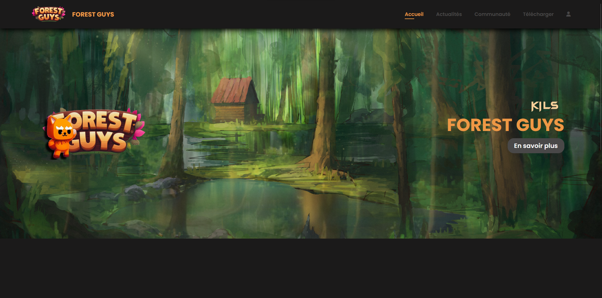

# Forest Guys Website

Forest Guys is a game in C# according to our S2 Project at our software engineer school, EPITA.
Here is available the source code of the Forest Guys's website.

## 🛠 Skills developed
### Languages: 
 *  
 *  
 * 
 * 

### IDE/Tools:
 * 
 * 

## Author
- [@theodevelop](https://github.com/theodevelop)
